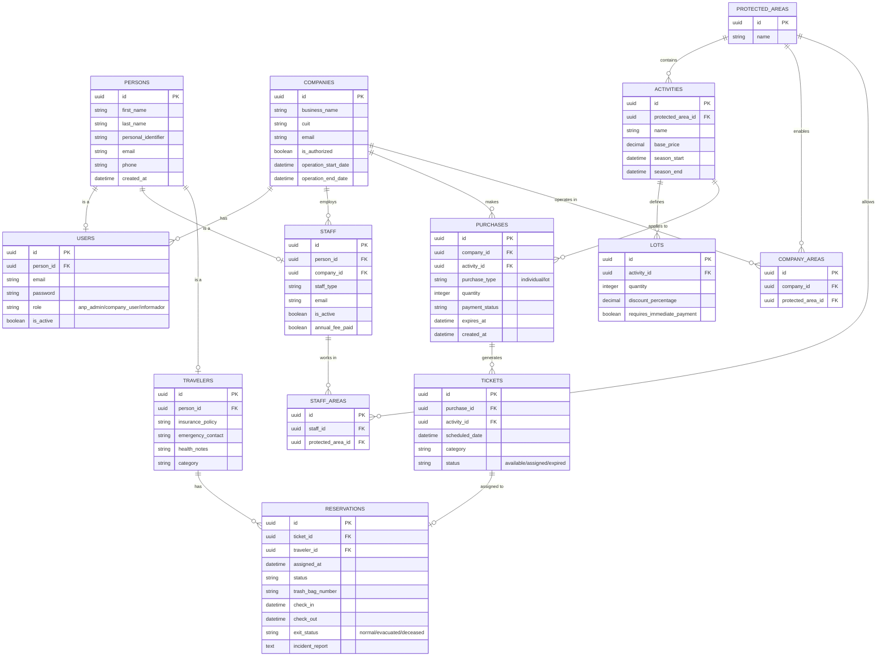

# Modelo de datos — V0.1

Modelo relacional para el sistema: personas base (`PERSONS`) con especialización en usuarios de aplicación, personal de empresa y visitantes; empresas prestadoras con ámbitos por área protegida; actividades y lotes en cada ANP; compras que generan tickets y reservas asignables a viajeros.

## Diagrama entidad–relación

## Resumen de relaciones

| Relación | Semántica |
|----------|-------------|
| `PERSONS` → `USERS` / `STAFF` / `TRAVELERS` | Una persona puede ser a lo sumo una de cada rol especializado (0..1 por subtipo). |
| `COMPANIES` → `USERS`, `STAFF`, `PURCHASES` | La empresa tiene usuarios de sistema, emplea personal y realiza compras. |
| `PROTECTED_AREAS` → `ACTIVITIES`, `COMPANY_AREAS`, `STAFF_AREAS` | El ANP define actividades y autoriza qué empresas operan y qué personal puede actuar en él. |
| `COMPANY_AREAS` / `STAFF_AREAS` | Tablas puente empresa–ANP y personal–ANP. |
| `ACTIVITIES` → `LOTS`, `PURCHASES` | La actividad define lotes opcionales y es el objeto de cada compra. |
| `PURCHASES` → `TICKETS` → `RESERVATIONS` | La compra desglosa en tickets; cada reserva enlaza un ticket con un viajero. |

## Dominios y enumeraciones (en modelo)

- **Rol de usuario:** `anp_admin`, `company_user`, `informador`.
- **Tipo de compra:** `individual`, `lot`.
- **Estado de ticket:** `available`, `assigned`, `expired`.
- **Estado de salida en reserva:** `normal`, `evacuated`, `deceased`.

## Notas de diseño

- **Identidad:** `PERSONS` centraliza datos personales; `USERS`, `STAFF` y `TRAVELERS` referencian `person_id` y pueden tener email propio donde aplique (p. ej. credenciales o contacto laboral).
- **Comercial:** `PURCHASES` agrega por actividad; `TICKETS` materializa unidades (con `scheduled_date` y categoría); la reserva conecta ticket y viajero y concentra operación en campo (bolsas, check-in/out, incidentes).
- **Temporalidad empresa:** `COMPANIES` incluye ventana `operation_start_date` / `operation_end_date` y flag `is_authorized`.

## Próximos refinamientos (fuera del diagrama)

- Índices únicos (p. ej. `personal_identifier`, `cuit`, emails según reglas de negocio).
- Política de borrado lógico vs. histórico obligatorio por entidad.
- Validaciones y catálogos cerrados para `staff_type`, `category`, `payment_status`, `status` en reservas, etc.
